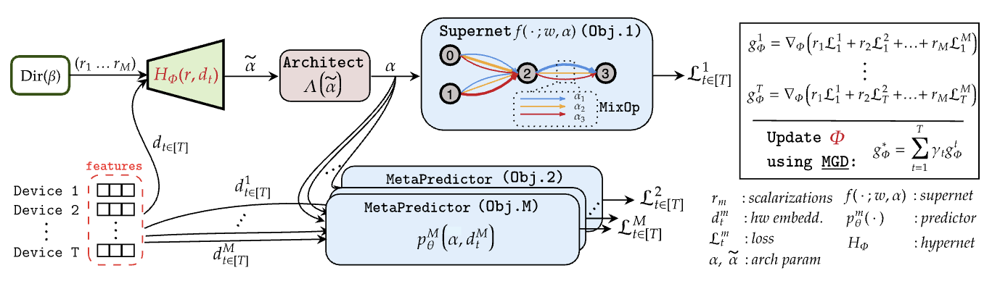

# MODNAS
## Official repo for the paper MODNAS: Multi-objective Differentiable Neural Architecture Search


## Overview
1. [Installation & Dependencies](#Dependencies)
2. [Working Tree and Dataset Preparation](#dataset)
3. [Experiments](#experiments)
    - [Pretrain hpns](#hpns)
    - [Pretrain predictors](#predictors)
    - [Search](#search)
    - [Scripts](#scripts)
    - [Evaluation](#evaluation)
4. [Plotting](#plotting)
5. [Baselines](#baselines)


## 1. Installation & Dependencies<a name="Dependencies"></a>


To install the dependencies:
```bash
conda create --name modnas python=3.9
conda activate modnas
pip install -r requirements.txt
```

## 2. Working Tree and Dataset Preparation <a name="dataset"></a>
### Code working tree
```
├── predictors
│   ├── hat
│   ├── help
│   ├── nb201
│   ├── ofa
├── hypernetworks
│   ├── models
│   ├── pretrain_hpns
├── scripts
├── optimizers
│   ├── help
│   ├──mgd
│   ├── mixop
│   ├── sampler
│   ├── optim_factory.py
├── plotting
├── search_spaces
│   ├── hat
│   ├── MobileNetV3
│   ├── nb201
```

The ```predictors``` folder contains the meta predictors for different search spaces

The ```hypernetworks``` folder contains the architectures of our hypernetworks for different search spaces

The ```scripts``` folder contains the scripts to batch different jobs

The ```optimizers``` folder contains the different one-shot and black box optimizers for architecture search

The ```plotting``` folder contains the scripts used for radar plots

The ```search_spaces``` folder contains the definition of the search spaces search spaces nasbench201, mobilenetv3, hardware aware transformers

The ```predictor_data_utils``` and  ```hypernetwork_data_utils``` folder contains the pretrained predictors and hypernetworks respectively

The ```baselines``` folder contains the scripts to run the synetune baselines for different search spaces.

### Dataset preparation

```CIFAR10``` and ```CIFAR100``` datasets will be automatically downloaded
Download the ```imagenet-1k``` from [here](https://www.image-net.org/download.php) and update the path to the dataset in the training script. The dataset Imagenet16-120 

Follow the instructions [here](https://github.com/mit-han-lab/hardware-aware-transformers) to download the binary files for the different machine translation datasets.

## 3. Experiments <a name="experiments"></a>
### Pretrain Hypernetworks for NAS-Bench-201, MobileNetV3, Hardware-Aware-Transformers <a name="hpns"></a>
```bash
python hypernetworks/pretrain_hpns/pretrain_hpns_nb201.py
```
```bash
python hypernetworks/pretrain_hpns/pretrain_hpns_ofa.py
```
```bash
python hypernetworks/pretrain_hpns/pretrain_hpns_hat.py
```
### Pretrain Predictors for NAS-Bench-201, MobileNetV3, Hardware-Aware-Transformers <a name="#predictors"></a>
```bash
python predictors/nb201/train/train_predictor.py
```

```bash
python predictors/ofa/train/train_ofa_predictor.py
```

```bash
python predictors/hat/train_latency_predictor.py --task wmt14.en-de
```

### Search  <a name="search"></a>
#### Search on the NB201 search space (across 13 devices)

```bash
python search_spaces/nb201/search_nb201_mgd.py \
    --save mgd-100epochs \
    --wandb_name "modnas-nb201-100epochs" \
    --optimizer_type "reinmax" \
    --arch_weight_decay 0.09 \
    --train_portion 0.5 \
    --learning_rate 0.025 \
    --learning_rate_min 0.001 \
    --seed 9001 \
    --epochs 100 \
    --load_path "predictor_data_utils/nb201/predictor_meta_learned.pth" \
    --w_grad_update_method "mean" \
    --hpn_grad_update_method "mgd" \
    --weight_decay 0.0027
```
#### Search on the MobileNetV3 search space (across 11 devices)
```bash
python -m torch.distributed.launch --nproc_per_node=8 --use_env search_spaces/MobileNetV3/search/mobilenet_search_base.py --one_shot_opt reinmax --opt_strategy "simultaneous" --hpn_type meta --use_pretrained_hpn 
```

#### Search on the Hardware Aware Transformers (HAT) search space (across 2 devices)
```bash
python search_spaces/hat/train.py --configs=search_spaces/hat/configs/wmt14.en-de/supertransformer/space0.yml
```
#### Search on the HW-GPT-Bench search space (across 5 gpu devices)
Download the pretrained supernet from [HW-GPT-Bench](https://github.com/automl/HW-GPT-Bench).
```bash
python -u search_spaces/gpt/train_llm_configurable_scratch.py -c juwels_owt_sw_s.yaml 
```
## 4. Bash scripts  <a name="scripts"></a>
The ```scripts/``` folder contains slurm scripts to launch the above search scripts

## 5. Evaluation <a name="evaluation"></a>
For **NB201** we evaluate the hypervolume during training

For **MobileNetV3** and **HAT** search spaces, obtain the architectures on the Pareto-Front using:
```bash
python evaluation/get_archs_ofa.py
 ```
```bash
python evaluation/get_archs_hat.py  --config-file search_spaces/hat/configs/wmt14.en-de/supertransformer/space0.yml --arch transformersuper_wmt_en_de2
 ```

To evaluate the archs from **MobileNetV3** space:

```bash
python search_spaces/MobileNetV3/eval_ofa_net.py --net ofa_mbv3_d234_e346_k357_w1.2
 ```

To evaluate the archs from **HAT** space:
```bash
python search_spaces/hat/eval_archs_hat.py 
```
We then use the scoring protocol for BLEU and Sacre-BLEU from [HAT](https://github.com/mit-han-lab/hardware-aware-transformers) to score the evaluations 

## 6. Plotting <a name="plotting"></a>

To make the radar plots we use the file ```plotting/plot_radar.py```

## 7. Baselines <a name="baselines"></a>

The ```baselines``` folder and the ```baseline_scripts``` folder contains the code to run different baselines on all different search spaces. 
